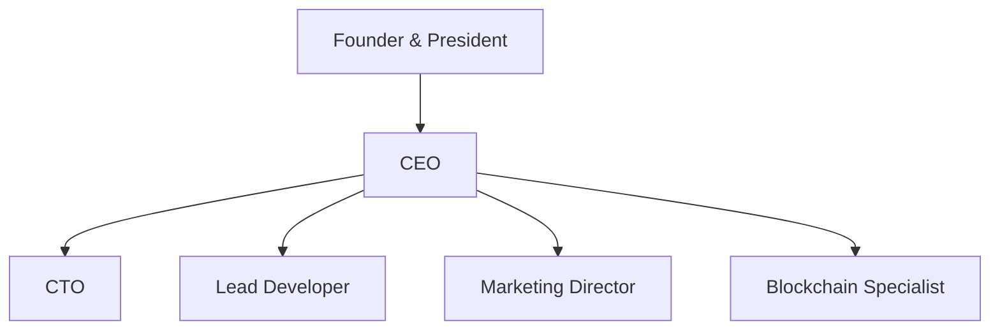
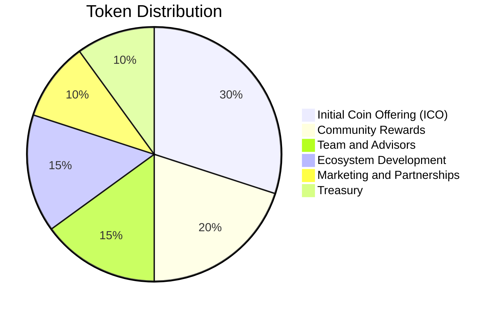
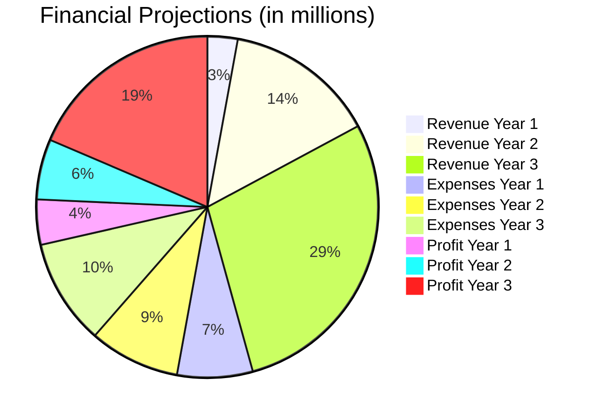
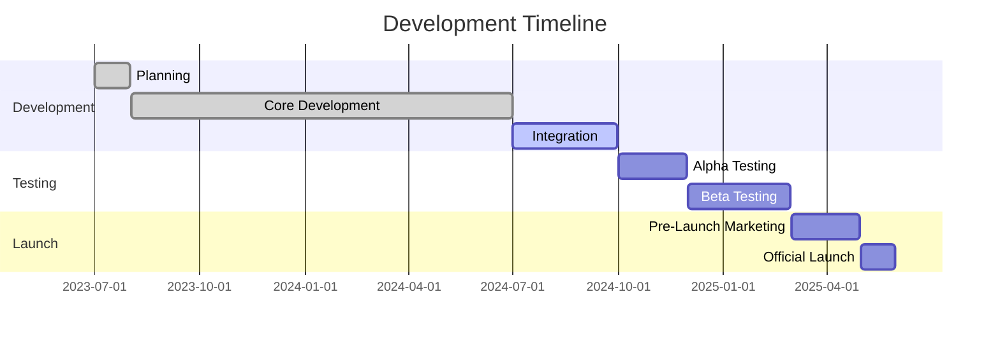
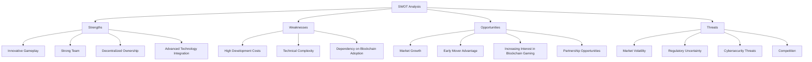
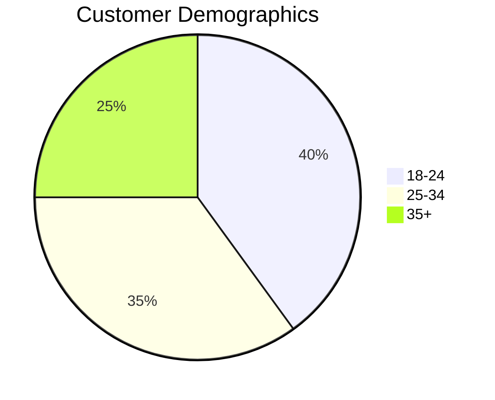
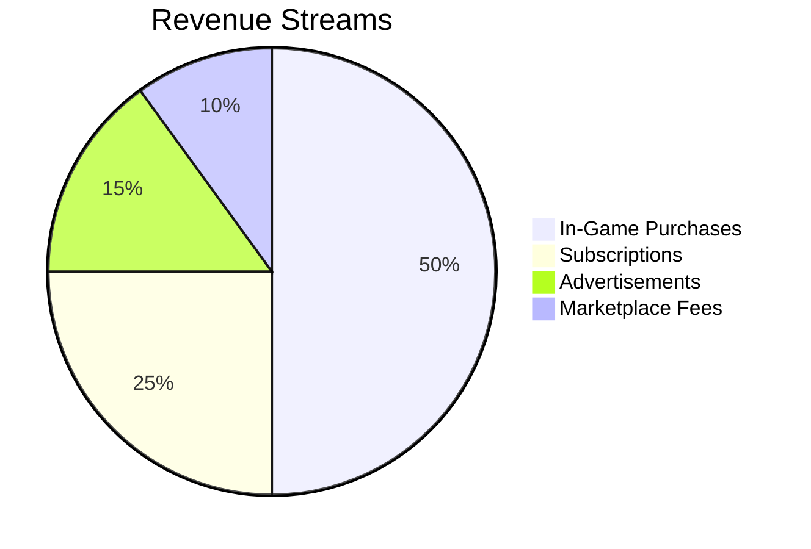

# CryptoQuest MMORPG: The Shards of Genesis
## WhitePaper


---

## Executive Summary

### Project Overview
**CryptoQuest: The Shards of Genesis (CQTSOG)** is a revolutionary blockchain-based MMORPG that integrates decentralized technology to offer players true ownership of in-game assets via NFTs. The game features an immersive world enhanced by AI and AR/VR technologies, creating a player-driven economy and unique gameplay experiences.

**Company:** CreoDAMO Inc.  
**Founder & President:** Jacque Antoine DeGraff  
**Location:** Miami, Florida  
**Contact:** Jacquedegraff@creodamo.com  

### Vision Statement
To create a groundbreaking MMORPG that empowers players with true ownership, fosters community-driven governance, and sets new standards in blockchain gaming.

### Unique Selling Proposition (USP)
CryptoQuest stands out with its innovative integration of AI, AR/VR technologies, and decentralized governance, offering an unparalleled immersive experience and a truly player-driven economy.

---

## Company Description

CreoDAMO, standing for Decentralized Asset Management and Optimization, is a visionary project helmed by a dedicated solo entrepreneur. It aims to transform asset management through blockchain technology and AI.

**Mission:** Pioneer the integration of blockchain technology into the gaming industry, providing players with ownership, transparency, and an engaging, interactive environment.

### Core Values
- **Innovation:** Constantly pushing the boundaries of technology and gameplay.
- **Transparency:** Ensuring fairness and clarity in all aspects of the game.
- **Community:** Building a strong, inclusive community where players have a voice.

### CryptoQuest Contract Interaction Outline

To help you understand the functionalities and interactions between the various contracts in the CryptoQuest ecosystem on the Polygon network, here's a detailed breakdown:

### Contract Overview

1. **CryptoQuestTheShardsOfGenesisToken (CQT)**
   - **Address**: ``
   - **Purpose**: Main utility token for the CryptoQuest ecosystem.

2. **CryptoQuestTheShardsOfGenesisNFT**
   - **Address**: ``
   - **Purpose**: Main contract for managing NFT assets within the game.

3. **CryptoQuestTheShardsOfGenesisCollectionNFT**
   - **Address**: ``
   - **Purpose**: Manages collections of NFTs, possibly for grouping related assets.

4. **TimelockControllerUpgradeable**
   - **Address**: `0x2b5949f0540884c67c1f169b9f535571656e6695`
   - **Purpose**: Implements a time-lock mechanism for contract upgrades and governance decisions.

5. **CryptoQuestTheShardsOfGenesisDAO**
   - **Address**: `0x7c3dddd47c29d213458abf9eb23fe50d95fa5205`
   - **Purpose**: Facilitates community-led governance and proposals for upgrades.

6. **CryptoQuestTheShardsOfGenesisMarketplace**
   - **Address**: `0xef805704fd13b0122477211895e418cb9c22e103`
   - **Purpose**: Marketplace for secure trading of NFT assets.

7. **CryptoQuestTheShardsOfGenesisStaking**
   - **Address**: `0x7ffc728c30192bf6f2f1448e395a8c9f751bc039`
   - **Purpose**: Incentivizes long-term holding of CQT through staking rewards.

8. **CryptoQuestTheShardsOfGenesisFarming**
   - **Address**: `0x822475be2d1b53680ceb3da287a7c608fed591a4`
   - **Purpose**: Provides liquidity mining rewards to users.

9. **CryptoQuestTheShardsOfGenesisMMORPG**
   - **Address**: `0x251ace49f2b106e0746702986e879e404a76f290`
   - **Purpose**: Core logic and rules of the virtual world are coded here.

10. **CryptoQuestTheShardsOfGenesisWallet**
    - **Address**: `0xf60d96cfa71c6fe7fe18ca028041ca7f42b543bd`
    - **Purpose**: Manages player accounts, inventories, and integrates with compatible crypto wallets.

11. **CryptoQuestTheShardsOfGenesisNFTBook**
    - **Address**: `0x545ace061a1b64b14641b50cfe317017b01a667b`
    - **Purpose**: Specific contract for book-related NFTs, likely providing unique assets.

12. **CQTTokenSaleContract**
    - **Address**: `0x126d0a70e6413ec44d977c41024a76d84cedb4a4`
    - **Purpose**: Manages the sale of CQT tokens to investors or users.

13. **CryptoQuestTheShardsOfGenesisBookNFTSalesContract**
    - **Address**: `0xe1df30dbeaf0e895bc5b7efd8b7b9ed91097c8d7`
    - **Purpose**: Manages the sale of book NFTs, facilitating tiered pricing and payment in various tokens.

### Interaction Summary

#### Governance and Upgrades
- **CryptoQuestTheShardsOfGenesisDAO** works with **TimelockControllerUpgradeable** to manage governance and upgrades. Proposals made by the DAO are subject to a time-lock before execution, ensuring community review and preventing hasty changes.

#### NFT Management
- **CryptoQuestTheShardsOfGenesisNFT** manages the main NFT assets within the game.
- **CryptoQuestTheShardsOfGenesisCollectionNFT** handles collections or groups of NFTs.
- **CryptoQuestTheShardsOfGenesisBookNFTSalesContract** facilitates the sale of book-related NFTs using different payment tokens.

#### Market and Trade
- **CryptoQuestTheShardsOfGenesisMarketplace** provides a secure platform for players to trade NFTs.

#### Token Incentives
- **CryptoQuestTheShardsOfGenesisStaking** and **CryptoQuestTheShardsOfGenesisFarming** offer rewards for staking and providing liquidity, encouraging long-term participation.

#### Game Logic and Player Interaction
- **CryptoQuestTheShardsOfGenesisMMORPG** contains the core game logic and rules, interacting closely with player-managed assets and accounts through **CryptoQuestTheShardsOfGenesisWallet**.

#### Token Sales
- **CQTTokenSaleContract** manages the distribution of CQT tokens, essential for in-game transactions and governance.


### Conclusion

This setup provides a robust framework for managing NFTs, tokens, governance, and marketplace interactions within the CryptoQuest ecosystem. By leveraging smart contracts on the Polygon network, you ensure transparency, security, and decentralization, enhancing the overall user experience and engagement. If you have any specific configurations or need further assistance, feel free to ask!

## CryptoQuest MMORPG Smartcontracts
```css
1.) CryptoQuestTheShardsOfGenesisToken

0xb30837f549...3c8a
Polygon
Visible
Public

ERC1967Proxy(CQT)

CryptoQuestTheShardsOfGenesisToken

0x94ef57abfb...1665
Polygon
Visible
Public

2.) CryptoQuestTheShardsOfGenesisNFT
0xc641573148e62d88a2374ffe97391f849cea8ff5
0xc641573148...8ff5
Polygon
Visible
Public

ERC1967Proxy
0xc641573148e62d88a2374ffe97391f849cea8ff5
CryptoQuestTheShardsOfGenesisNFT
0x74cf604c8c235eb1f520b47bf7106c46be815a30
0x74cf604c8c...5a30
Polygon
Visible
Public

3.) CryptoQuestTheShardsOfGenesisCollectionNFT
0x5ce6de14eaa1906163c5de4e57302fee8f5d2812
0x5ce6de14ea...2812
Polygon
Visible
Public

ERC1967Proxy
0x5ce6de14eaa1906163c5de4e57302fee8f5d2812
CryptoQuestTheShardsOfGenesisCollectionNFT
0x486f191e833a371f49f1500515997f583a2523f4
0x486f191e83...23f4
Polygon
Visible
Public

4.) TimelockControllerUpgradeable
0x2b5949f0540884c67c1f169b9f535571656e6695
0x2b5949f054...6695
Polygon
Visible
Public

5.) CryptoQuestTheShardsOfGenesisDAO
0x7c3dddd47c29d213458abf9eb23fe50d95fa5205
0x7c3dddd47c...5205
Polygon
Visible
Public

ERC1967Proxy
0x7c3dddd47c29d213458abf9eb23fe50d95fa5205
CryptoQuestTheShardsOfGenesisDAO
0xc44187f4eae5ddb4eda465ddedf8b9a6dfeb073c
0xc44187f4ea...073c
Polygon
Visible
Public

6.) CryptoQuestTheShardsOfGenesisMarketplace
0xef805704fd13b0122477211895e418cb9c22e103
0xef805704fd...e103
Polygon
Visible
Public

ERC1967Proxy
0xef805704fd13b0122477211895e418cb9c22e103
CryptoQuestTheShardsOfGenesisMarketplace
0x7e59e3fc320acfae0fbd20789348016729b00edc
0x7e59e3fc32...0edc
Polygon
Visible
Public

7.)CryptoQuestTheShardsOfGenesisStaking
0x7ffc728c30192bf6f2f1448e395a8c9f751bc039
0x7ffc728c30...c039
Polygon
Visible
Public

ERC1967Proxy
0x7ffc728c30192bf6f2f1448e395a8c9f751bc039
CryptoQuestTheShardsOfGenesisStaking
0x4915363b9524d103c8910e3c7d5516b9b4d0f333
0x4915363b95...f333
Polygon
Visible
Public

8.) CryptoQuestTheShardsOfGenesisFarming
0x822475be2d1b53680ceb3da287a7c608fed591a4
0x822475be2d...91a4
Polygon
Visible
Public

ERC1967Proxy
0x822475be2d1b53680ceb3da287a7c608fed591a4
CryptoQuestTheShardsOfGenesisFarming
0x95e2091ec85d20253a9cc7f37b1308bd56e8732f
0x95e2091ec8...732f
Polygon
Visible
Public

9.)CryptoQuestTheShardsOfGenesisMMORPG
0x251ace49f2b106e0746702986e879e404a76f290
0x251ace49f2...f290
Polygon
Visible
Public

ERC1967Proxy
0x251ace49f2b106e0746702986e879e404a76f290
CryptoQuestTheShardsOfGenesisMMORPG
0xc233e56015c1bbcd7fbd58415d11084e7f98f488
0xc233e56015...f488
Polygon
Visible
Public

10.)CryptoQuestTheShardsOfGenesisWallet
0xf60d96cfa71c6fe7fe18ca028041ca7f42b543bd
0xf60d96cfa7...43bd
Polygon
Visible
Public

ERC1967Proxy
0xf60d96cfa71c6fe7fe18ca028041ca7f42b543bd
CryptoQuestTheShardsOfGenesisWallet
0xcb393b9cb94ac7f35f05e001c4b0d512fc590eb2
0xcb393b9cb9...0eb2
Polygon
Visible
Public

11.) CryptoQuestTheShardsOfGenesisNFTBook
0x545ace061a1b64b14641b50cfe317017b01a667b
0x545ace061a...667b
Polygon
Visible
Public

ERC1967Proxy
0x545ace061a1b64b14641b50cfe317017b01a667b
0x545ace061a...667b
0x6b07ad60b1d448d0e1ce9dcb24a85b3ab18b9b1e
0x6b07ad60b1...9b1e
Polygon
Visible
Public

12.) CQTTokenSaleContract
0x126d0a70e6413ec44d977c41024a76d84cedb4a4
0x126d0a70e6...b4a4
Polygon
Visible
Public

ERC1967Proxy
0x126d0a70e6413ec44d977c41024a76d84cedb4a4
0x126d0a70e6...b4a4
0xc36fc9872bd271bd80365517958e6f48d3b4fa91
0xc36fc9872b...fa91
Polygon
Visible
Public

13.) CryptoQuestTheShardsOfGenesisBookNFTSalesContract
0xe1df30dbeaf0e895bc5b7efd8b7b9ed91097c8d7
0xe1df30...97c8d7
Polygon
Visible
Public

ERC1967Proxy
0xe1df30dbeaf0e895bc5b7efd8b7b9ed91097c8d7
0xe1df30...97c8d7
0x8206b3a98dbd4e3cd767e0e5caba6c6af68044c8
0x8206b3...8044c8
Polygon
Visible
Public
```
---

## Market Analysis

### Industry Overview
The global gaming industry is projected to reach $200 billion by 2024, with blockchain gaming becoming a significant segment. The rise of NFTs and play-to-earn models are driving new growth opportunities.

### Target Market
- **Primary:** Gamers aged 18-35 interested in blockchain technology and NFTs.
- **Secondary:** Cryptocurrency enthusiasts and blockchain investors.

### Competitive Analysis
Competitors include Axie Infinity, Decentraland, and The Sandbox. CQTSOG differentiates itself through its immersive gameplay, advanced technological integration, and player-driven economy.

### Market Size and Growth Projections


### User Personas
- **Persona 1: Alex**
  - 25 years old, avid gamer since childhood. Spends 15 hours/week gaming.
  - Frustrated by "pay-to-win" models where real money is required to progress. Wants to retain value from time invested.
  - Enjoys MMORPGs for their open worlds and community aspects. Last game was World of Warcraft but lost interest after a few years.

- **Persona 2: Jamie**
  - 32, has followed cryptocurrency for 5 years and sees the potential of blockchain to revolutionize industries like gaming.
  - Used to play games more casually but now prefers investing spare income. Looking for new opportunities in emerging technologies.
  - Intrigued by "play-to-earn" models after learning about Axie Infinity but wants a more engaging gaming experience.

---

## Organization and Management

### Leadership Team
- **Founder & President:** Jacque Antoine DeGraff
- **CEO:** Jacque Antoine DeGraff
- **CTO:** To Be Announced
- **Lead Developer:** To be Announced
- **Marketing Director:** To Be Announced
- **Blockchain Specialist:** To Be Announced

### Advisors
Blockchain experts, game design veterans, and financial analysts.

### Team Bios
- **Jacque Antoine DeGraff:** Founder and President with over 15 years of experience in game development and blockchain technology.
- **CEO:** Experienced executive with a background in tech startups and game publishing.
- **CTO:** Tech expert specializing in blockchain integration and scalable architectures.
- **Lead Developer:** Senior game developer with extensive experience in MMORPGs.
- **Marketing Director:** Marketing strategist with a track record of successful game launches.
- **Blockchain Specialist:** Expert in blockchain technologies and smart contracts.

### Organizational Chart


You can edit and save this diagram on the [MermaidChart editor](https://www.mermaidchart.com/app/mermaid-chart-save/2024-07-21/174fac08-cb7f-464b-a1ad-42a9ebc3ef3f).

---

## Service or Product Line

### Product
CryptoQuest: The Shards of Genesis (CQTSOG) is a blockchain-based MMORPG where players can own, trade, and sell in-game assets on decentralized marketplaces.

### Features
- NFT-based asset ownership
- Player-driven economy
- AI-enhanced interactions
- AR/VR gameplay elements
- Decentralized player governance
- Cross-chain interactions for broader ecosystem engagement

### Technology Stack
- **Blockchain:** Ethereum, Polygon
- **Game Engine:** Unity, Unreal Engine 5
- **AI/AR/VR Technologies:** Custom-built solutions and third-party integrations

---

## Tokenomics

### CQT (CryptoQuest Token)
The CryptoQuest ecosystem is powered by the CQT (CryptoQuest Token), an ERC-20 token built on the Ethereum blockchain. The CQT token serves as the primary currency for in-game transactions, player-to-player trades, and interactions with the broader CryptoQuest ecosystem.

### Token Distribution
- **Total Supply:** 1 billion CQT tokens
- **Initial Coin Offering (ICO):** 30% of total supply
- **Community Rewards:** 20% of total supply
- **Team and Advisors:** 15% of total supply
- **Ecosystem Development:** 15% of total supply
- **Marketing and Partnerships:** 10% of total supply
- **Treasury:** 10% of total supply

### Token Utility
- **In-Game Transactions:** CQT tokens will be used for purchasing in-game items, services, and land.
- **Player-to-Player Trades:** Players can use CQT tokens to trade NFT-based assets on the CryptoQuest marketplace.
- **Governance:** CQT token holders will have a say in the decision-making process for the game's development and ecosystem.
- **Staking and Rewards:** Players can stake their CQT tokens to earn additional rewards and participate in the game's governance.
- **Cross-Chain Interactions:** CQT tokens can be used for interactions with other blockchain-based games and platforms, fostering a broader ecosystem.

### Token Release Schedule
- **ICO:** 20% of tokens released at launch, with the remaining 80% vested over 24 months.
- **Community Rewards:** 25% of tokens released at launch, 25% vested over 12 months, and 50% vested over 24 months.
- **Team and Advisors:** 10% of tokens released at launch, 30% vested over 12 months, and 60% vested over 24 months.
- **Ecosystem Development:** 20% of tokens released at launch, 40% vested over 12 months, and 40% vested over 24 months.
- **Marketing and Partnerships:** 30% of tokens released at launch, 40% vested over 12 months, and 30% vested over 24 months.
- **Treasury:** 10% of tokens released at launch, 30% vested over 12 months, and 60% vested over 24 months.

### Initial Price Recommendation for CQT Token on Uniswap

Based on the detailed analysis of key factors, the recommended initial price for the CQT (CryptoQuest Token) on Uniswap V4 is **$0.30** per token. 

### Justification for the Price:

1. **Total Supply and Distribution**:
   - With a total supply of **1 billion CQT tokens** and **300 million available during the ICO**, starting at $0.30 allows for a balanced entry point that is accessible to early investors while reflecting the potential for future growth.

2. **Market Analysis**:
   - Targeting gamers aged **18-35** and blockchain enthusiasts, this price point positions CQT competitively within the market. Notably, Axie Infinity’s initial price at **$0.10** sets a precedent, but CQT's unique features and utility justify a higher entry point.

3. **Token Utility**:
   - The diverse functionalities of CQT tokens—ranging from in-game transactions to governance and staking—enhance the token's value proposition, supporting the rationale for the $0.30 price.

4. **Revenue Projections**:
   - The projected revenue growth from **$1 million in Year 1** to **$10 million by Year 3** indicates strong financial performance, supporting a valuation that reflects future earnings potential.

5. **Community Feedback**:
   - Feedback suggesting an initial price range of **$0.30 to $0.50** aligns with the proposed $0.30 price, ensuring accessibility for investors while allowing room for appreciation as the game and ecosystem develop.

### Liquidity and Initial Setup:

- **Initial Liquidity**: It’s crucial to ensure adequate liquidity to facilitate smooth trading on Uniswap. 
- **Pairing**: Pairing CQT with **ETH or a stablecoin like USDT** is advisable to enhance trading stability.

### Calculation Example:

- **Initial Liquidity Setup**:
   - Assuming we provide **100 ETH** and **1,000,000 CQT** tokens as initial liquidity:
   - If **1 ETH = $2,000**, then **100 ETH = $200,000** total value.
   - **Initial CQT Price in ETH**: \( \frac{100 \text{ ETH}}{1,000,000 \text{ CQT}} = 0.0001 \text{ ETH per CQT} \).
   - **Initial CQT Price in USD**: \( 0.0001 \text{ ETH} \times 2000 = 0.30 \text{ USD per CQT} \).

### Final Considerations:

- **Monitoring**: Post-launch, it’s essential to monitor market conditions and community sentiment. Be ready to adjust liquidity and potentially the price as the project gains traction and user engagement grows.
  
This approach balances early adoption incentives with the potential for future growth, setting a solid foundation for the CryptoQuest ecosystem.

### Token Distribution


You can edit and save this diagram on the [MermaidChart editor](https://www.mermaidchart.com/app/mermaid-chart-save/2024-07-21/b0de2a51-3a94-4d81-bd5a-6f18e2fa0984).

---

## Marketing and Sales Strategy

### Marketing Plan
- **Pre-Launch:** Social media campaigns, influencer partnerships, community engagement on platforms like Discord and Reddit.
- **Launch:** Virtual events, collaborations with gaming platforms, targeted advertising.
- **Post-Launch:** Continuous engagement through updates, expansions, and community activities.

### Sales Strategy
- **In-Game Purchases:** Unique in-game assets sold as NFTs.
- **Subscriptions:** Premium memberships with exclusive content.
- **Advertisements:** Partnerships for in-game ads and sponsorships.

### Customer Acquisition Cost (CAC) and Lifetime Value (LTV)
- **CAC:** $20 per user
- **LTV:** $200 per user

### Marketing Channels
- **Social Media:** Targeted ads on Facebook, Instagram, and Twitter.
- **Influencers:** Collaborations with gaming influencers for live streams and reviews.
- **Community Engagement:** Active participation and events on Discord and Reddit.
- **Partnerships:** Strategic partnerships with blockchain platforms and gaming communities.

---

## Funding Request

### Total Funding Required
$10,000,000

### Allocation
- **Development:** $5,000,000
- **Marketing:** $2,000,000
- **Operations:** $2,000,000
- **Contingency:** $1,000,000

### Milestone-Based Funding
1. **Initial Development:** $2 million to complete core game mechanics and blockchain integration.
2. **Alpha and Beta Testing:** $1 million for extensive testing phases.
3. **Launch Preparation:** $2 million for final preparations and marketing campaigns.
4. **Post-Launch Support:** $3 million for ongoing development and community engagement.
5. **Expansion and Scaling:** $2 million for expanding features and scaling operations.

---

## Financial Projections

### Revenue Projections
- **Year 1:** $1,000,000
- **Year 2:** $5,000,000
- **Year 3:** $10,000,000

### Expense Projections
- **Year 1:** $2,500,000
- **Year

 2:** $3,000,000
- **Year 3:** $3,500,000

### Profit/Loss
- **Year 1:** -$1,500,000
- **Year 2:** $2,000,000
- **Year 3:** $6,500,000

### Visual Financial Projections


You can edit and save this diagram on the [MermaidChart editor](https://www.mermaidchart.com/app/mermaid-chart-save/2024-07-21/5804fd9f-4c0c-419e-96ad-b34ab5de6b1a).

### Sensitivity Analysis
- **Base Case:** Expected growth rate and revenue projections.
- **Optimistic Case:** 25% higher retention from engaging gameplay fueling 25% higher revenue.
- **Pessimistic Case:** Delays or lower interest temporarily slowing growth 15-20%.

### Break-Even Analysis
The project is expected to break even by Year 2 with a user base of 100,000 active players.

### User Growth
- **Years 1-2:** Leverage network effects of early adopters and ambassador program, focus heavily on community/influencer engagement.
- **Years 2-3:** Expand to new markets and blockchain platforms to achieve exponential growth.

### Monetization
- **Initial Focus:** Cosmetic/utility NFT sales with subscription plans introduced in Year 2.
- **Marketplace Fees and Advertising:** Integrated in Year 3 as economy matures to diversify revenue.

---

## Development Timeline

### Gantt Chart


You can edit and save this diagram on the [MermaidChart editor](https://www.mermaidchart.com/app/mermaid-chart-save/2024-07-21/424f7d6c-09db-4212-ba30-961b146784f3).

### Detailed Phases
- **Phase 1:** Initial development (game mechanics, blockchain integration)
- **Phase 2:** Alpha testing and feedback incorporation
- **Phase 3:** Beta testing and final optimizations
- **Phase 4:** Pre-launch marketing and community building
- **Phase 5:** Official launch and post-launch support

---

## Risk Analysis

### SWOT Analysis


You can edit and save this diagram on the [MermaidChart editor](https://www.mermaidchart.com/app/mermaid-chart-save/2024-07-21/bcd1b230-c645-4df8-ae6d-c66e6a25b27e).

### Risk Mitigation Strategies
1. **Financial Risks:** Secure diverse funding sources and maintain a contingency fund.
2. **Technical Risks:** Employ a robust development process with extensive testing phases and regular updates.
3. **Market Risks:** Conduct continuous market research and adapt strategies based on player feedback and industry trends.
4. **Regulatory Risks:** Stay updated on regulatory changes and ensure compliance with all relevant laws and guidelines.
5. **Cybersecurity Risks:** Implement stringent security measures, conduct regular audits, and educate the community about best practices.

---

## Customer Demographics

### Age
18-35

### Gender
Predominantly male, with a growing female player base.

### Location
Primarily North America and Europe, with expanding interest in Asia.

### Interests
Gaming, cryptocurrency, technology, and digital art.

### Behavior
Tech-savvy, early adopters, engaged in online communities, and interested in earning through gaming.

### Demographic Analysis Visualization


You can edit and save this diagram on the [MermaidChart editor](https://www.mermaidchart.com/app/mermaid-chart-save/2024-07-21/73869cd1-dbd4-4376-a41b-ad76195e87bd).

### User Engagement Strategies
- **Community Building:** Foster a strong community through active engagement on social media, Discord, and Reddit.
- **Events and Competitions:** Host regular in-game events and competitions to maintain player interest.
- **Feedback Loops:** Implement feedback mechanisms to continuously improve the game based on player input.
- **Content Updates:** Regularly release new content, expansions, and features to keep the game fresh and engaging.

---

## Revenue Streams Breakdown

### Primary Revenue Streams
1. **In-Game Purchases:** Sales of NFTs, character customization, and other digital assets.
2. **Subscriptions:** Premium memberships offering exclusive content and benefits.
3. **Advertisements:** Partnerships for in-game advertising and sponsorship deals.
4. **Marketplace Fees:** Transaction fees from player-to-player trading of NFTs.

### Revenue Streams Visualization


You can edit and save this diagram on the [MermaidChart editor](https://www.mermaidchart.com/app/mermaid-chart-save/2024-07-21/17eb4cc8-a4a0-40ce-a843-9c44be843dd5).

---

## Appendices

### Appendix A: Glossary of Terms
- **MMORPG:** Massively Multiplayer Online Role-Playing Game
- **NFT:** Non-Fungible Token
- **AR/VR:** Augmented Reality/Virtual Reality
- **DAO:** Decentralized Autonomous Organization
- **CAC:** Customer Acquisition Cost
- **LTV:** Lifetime Value

### Appendix B: Detailed Financial Statements
- Income statement
- Balance sheet
- Cash flow statement

### Appendix C: Technical Specifications
- Detailed description of the technology stack
- Blockchain integration process
- AI/AR/VR technologies utilized

### Appendix D: Market Research Data
- Surveys and studies on gaming industry trends
- Analysis of blockchain adoption rates
- Competitor analysis

### Appendix E: Legal Documents
- Intellectual property rights
- Terms of service and privacy policy


- Compliance with blockchain regulations

---

## Contact Information

**Founder & President:** Jacque Antoine DeGraff  
**Company Name:** CreoDAMO Inc.  
**Location:** Miami, Florida, United States of America  
**Email:** Jacquedegraff@creodamo.com  
**Website:** [Updating/Coming Soon]  
**LinkedIn:** [https://www.linkedin.com/in/jacque-degraff-08529b2a5/]  
**Twitter:** [https://x.com/CreoDAMO]  

---

This whitepaper outlines the strategic vision, market potential, and financial projections for CryptoQuest: The Shards of Genesis. Our goal is to create a unique and engaging gaming experience that leverages the power of blockchain technology to offer players true ownership and a vibrant, player-driven economy. We are confident in our team's ability to execute this vision and look forward to bringing this innovative game to market.

